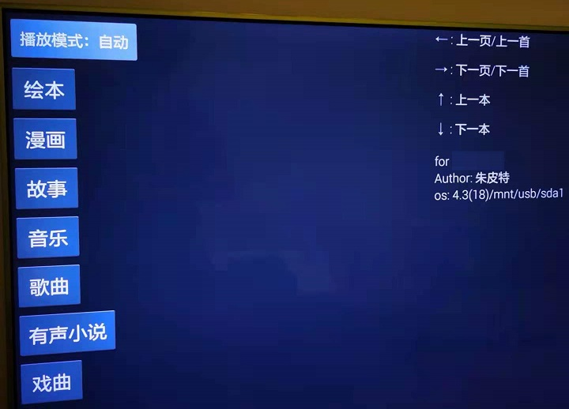
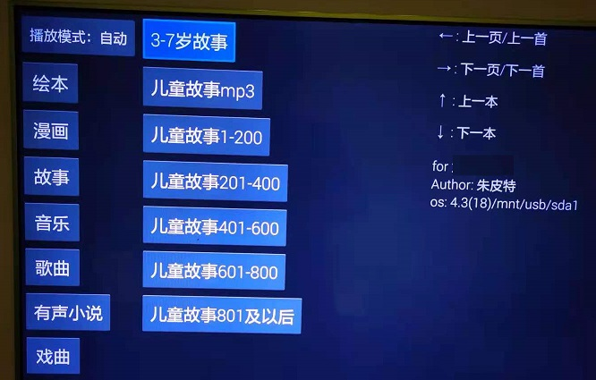
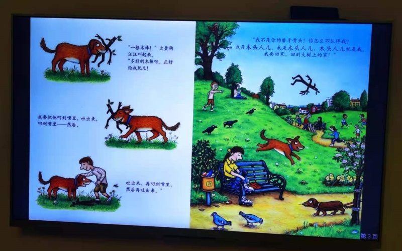
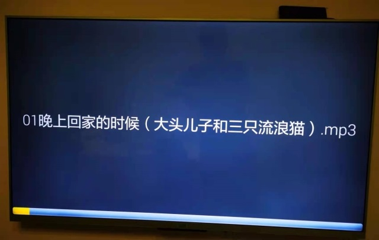

---
layout:		post
category:	"android"
title:		"编写一个会讲绘本的安卓电视应用APP"
tags:		[android]
---
- Content
{:toc}


# 背景

家里有孩子的基本上都逃脱不掉要给孩子看绘本讲绘本，无奈为父时间较少、普通话不标准、讲的效果也不好、嗓子经常性干哑、以及懒等各种理由。但是又想让孩子多听多看一些，就想着利用工具给孩子自动播放。

手机和PAD自然可行，但是这两种东西交互性太强了，小孩子容易拿来玩乱七八糟的东西，不容易专注，离得太近容易伤到眼睛。后来想到电视应用，电视的交互性差一些，比较适合，于是决定自己动手写个简单的TV应用。

总体目标是以最简单快捷的方式实现这个想法。


# 设想

- 创建一个简单的电视应用，全屏在电视上播放。可以参考「[Android TV H5 电视应用](./android-tv-h5-app.html)」
- 考虑绘本的特点，要能同时播放绘本图画和声音。
- 搜集下载一批有声有色的绘本资源素材供本地使用。
- 电视的存储空间有限，资源素材以U盘形式存储，APP访问。
- 为方便扩展，U盘目录有序组织，设置一个根索引文件，方便配置。
- 小孩子不宜观看电视太久，可以扩展一个只播放儿童音乐、故事纯音频的功能。
- 既然可以只播放纯音频，又可以继续扩展给带孩子的老人播放戏曲，或者纯音乐的功能，这些是附加，不是主要的，能扩展即可。
- 既然绘本是同时播放图片和音频的，砍掉任意一个功能，又可以演变：只播放音频的功能上面提了，如果只播放图片的，可以应用为：幻灯片播放家庭照片，查看电子书、漫画等。这些是附加，不是主要的，能扩展即可。


# 实现

总体思路是，下载一批绘本资源、纯音频资源，分目录组织存放在U盘里。U盘根目录下创建一个文件夹专门存放这些资源，并设置一个菜单索引文件。App启动时自动遍历存储设备，根据文件特征判断是否是插入的U盘，并解析菜单索引文件展示菜单列表，支持遥控器上下左右按键选择菜单，选中后根据资源类型播放不同的资源。播放时支持遥控器的上下左右按键操控。


## 获取U盘路径

第一次编写电视应用，设备不在身旁，使用的是原生TV模拟器，这个TV模拟器有很多问题，声音播放不了。所以要试着猜想届时真机运行时的状态，一开始假想了很多场景，所幸的是最终拿到家里电视上安装运行的时候比较顺利，音频可以流畅播放。


为了方便获取U盘路径，在U盘根目录下探测名为**tvbooks**的文件夹是否存在，如果存在则认为是找到了U盘。

```java
public class Settings {
    private static String USBPath = null;// null;   "/data/local/tmp"; //测试模拟器时的路径，release版本时使用null

    // 放在U盘根目录的目录名
    private static String RootName = "tvbooks";

    // 根目录下的菜单配置文件名
    public static String MenuFileName = "menu.txt";

    private static String RootPath = null;

    // 每个分类目录下放置一个目录索引，内容为：每行是一本书的名称，utf-8格式编码，以支持中文
    public static String BookIndexFileName = "index.txt";


    // 获取U盘路径
    public static String getUSBPath(Context context) {
        if (USBPath == null) {
            // usb paths
            List<String> usbPaths = UsbUtil.getStorageList();
            for (int i = 0; i < usbPaths.size(); i++) {
                File file = new File(usbPaths.get(i), RootName);
                if (file.exists()) {
                    USBPath = usbPaths.get(i);
                    break;
                }
            }

            if (USBPath == null) {
                String sdcardPaths[] = UsbUtil.getVolumePaths(context);
                if (sdcardPaths != null) {
                    for (int i = 0; i < sdcardPaths.length; i++) {
                        File file = new File(sdcardPaths[i], RootName);
                        if (file.exists()) {
                            USBPath = sdcardPaths[i];
                            break;
                        }
                    }
                }
            }

            if (USBPath == null) {
                String externalDir = Environment.getExternalStorageDirectory().getAbsolutePath();
                File file = new File(externalDir, RootName);
                if (file.exists()) {
                    USBPath = externalDir;
                }
            }
        }

        return USBPath;
    }

    public static String getRootPath(Context context) {
        if (RootPath == null) {
            RootPath = getUSBPath(context) + "/" + RootName;
        }
        return RootPath;
    }
}
```


## 菜单列表

为了方便展示播放菜单，在这个tvbooks目录下创建一个菜单文件：**menu.txt**，用做配置，大致如下：

```json
{
"menu": [{
		"name": "绘本",
		"type": "audio_image"
	},
	{
		"name": "漫画",
		"type": "audio_image"
	},
	{
		"name": "故事",
		"type": "audio",
		"submenu": [
			{
				"name": "3-7岁故事"
			},
			{
				"name": "儿童故事mp3"
			},
			{
				"name": "儿童故事1-200"
			},
			{
				"name": "儿童故事201-400"
			},
			{
				"name": "儿童故事401-600"
			},
			{
				"name": "儿童故事601-800"
			},
			{
				"name": "儿童故事801及以后"
			}
		]
	},
	{
		"name": "音乐",
		"type": "audio",
		"submenu": [
			{
				"name": "纯音乐"
			}
		]
	},
	{
		"name": "歌曲",
		"type": "audio",
		"submenu": [
			{
				"name": "80年代经典老歌曲500首"
			},
			{
				"name": "流行"
			},
			{
				"name": "抖音神曲"
			}
		]
	},
	{
		"name": "有声小说",
		"type": "audio",
		"submenu": [{
				"name": "baishe"
			},
			{
				"name": "sanguo"
			},
			{
				"name": "xiyou"
			}
		]
	},
	{
		"name": "戏曲",
		"type": "audio",
		"submenu": [{
				"name": "郭永章河南坠子"
			},
			{
				"name": "豫剧选段"
			},
			{
				"name": "豫剧红脸王李世民游阴山"
			}
		]
	}
]
}
```

- **name**就是展示在应用里的菜单名，同时也是资源的文件夹名。

- **submenu**为子菜单，最多为二级菜单，可选。

- **type**预设三种类型：
  - **audio**：纯音乐模式，说明该目录下仅是音频文件，循环播放目录下的音频文件即可。
  - **image**：纯图片模式，说明该目录下仅是图片文件，幻灯片的方式播放图片即可。这个后来代码没有实现，因为生活中暂不需要。
  - **audio_image**：绘本模式，说明该目录下是图声并存的绘本资源，需要展示图片同时播放音频。


tvbooks目录下的文件组织形式是这样的：

```
歌曲
故事
绘本
漫画
戏曲
音乐
有声小说
menu.txt
```


## 资源准备

从网上搜索查找同时有图和声音的绘本资源，找到了一个比较好的资源网站：[波比在线-绘本馆](http://www.littlebobby.com.cn/home/main/huibenlist_all?tid=8)， 全部下载下来，一共下载了一千多本，每个绘本以单独的文件夹存放。


另外找了上千首儿歌、故事，分目录存放。文件组织形式比较简单，参考了在线绘本的形式，某一页就是对应一个jpg和一个mp3文件，因此一个绘本目录下的资源文件是这样的：

```
1.jpg
1.mp3
2.jpg
2.mp3
3.jpg
3.mp3
4.jpg
4.mp3
5.jpg
5.mp3
……
```

切换下一本上一本，其实就是变更目录；切换上一页下一页，其实就是把序号变更下。实现起来都比较简单。


## 编写代码

### 基类

播放纯音乐的和播放绘本的功能分开实现（分别为：**PlayAudioActivity**、**PlayHuibenActivity**），但有一些复用的功能，可以抽离出来作为基类（**PlayBaseActivity**），方便复用代码，基类代码如下：

```java

public abstract class PlayBaseActivity extends AppCompatActivity {
    public static final int MSG_FILES_FOUND_OK = 0;
    public static final int MSG_PLAY_NEXT = 1;
    public static final int MSG_UPDATE_PROGRESS = 2;

    protected SharedPreferences mSP;

    protected ProgressBar progressBar;
    protected MediaPlayer mediaPlayer = null;

    // 是否自动播放
    protected boolean isAutoPlayMode = true;

    protected int currentPlayResIndex = 0;
    protected int currentPlayIndex = 0;

    // 记录上一次切换的时间
    protected long lastChangeTime = 0;

    // 本页有无音频
    protected boolean isAudioExistThisPage = true;

    // 如果自动播放图片，默认多少秒切换
    protected int delaySecondsPerPage = 10;

    // 音频播放完成后延迟的秒数，然后再自动播放下一个
    protected int delaySecondsPerAudio = 4;

    //更新UI
    protected Runnable updateUI = null;

    //主线程创建handler，在子线程中通过handler的post(Runnable)方法更新UI信息。
    protected Handler handerUpdateUI = new Handler();

    protected Handler handler;

    @Override
    protected void onCreate(Bundle savedInstanceState) {
        super.onCreate(savedInstanceState);
        requestWindowFeature(Window.FEATURE_NO_TITLE);
        supportRequestWindowFeature(Window.FEATURE_NO_TITLE);
        getWindow().setFlags(WindowManager.LayoutParams.FLAG_FULLSCREEN, WindowManager.LayoutParams.FLAG_FULLSCREEN);
        getWindow().addFlags(WindowManager.LayoutParams.FLAG_KEEP_SCREEN_ON);   //应用运行时，保持屏幕高亮，不锁屏
        mSP = getSharedPreferences("cache", Context.MODE_PRIVATE);
        isAutoPlayMode = mSP.getBoolean("isAutoPlay", true);
    }

    abstract protected void onAudioPlayCompletion();

    abstract protected void turnNextRes(boolean isManualClick);
    abstract protected void turnNextPage(boolean isManualClick);

    public void setDelaySecondsPerPage(int seconds) {
        this.delaySecondsPerPage = seconds;
    }

    public void setDelaySecondsPerAudio(int seconds) {
        this.delaySecondsPerAudio = seconds;
    }

    public int getDelaySecondsPerAudio() {
        return this.delaySecondsPerAudio;
    }

    //释放资源
    @Override
    protected void onDestroy() {
        this.release();
        super.onDestroy();
    }

    @Override
    protected void onPause() {
        this.release();
        super.onPause();
    }

    protected void release() {
        handerUpdateUI.removeCallbacks(updateUI);
        if (mediaPlayer != null) {
            mediaPlayer.stop();
            mediaPlayer.release();
            mediaPlayer = null;
        }
    }

    @Override
    public boolean dispatchKeyEvent(KeyEvent event) {
        int keyCode = event.getKeyCode();
        int action = event.getAction();
        return handleKeyEvent(action, keyCode) || super.dispatchKeyEvent(event);
    }

    private boolean handleKeyEvent(int action, int keyCode) {
        if (action != KeyEvent.ACTION_DOWN)
            return false;

        switch (keyCode) {
            case KeyEvent.KEYCODE_BACK:
            case KeyEvent.KEYCODE_HOME: {
                this.release();
            }
            break;
            case KeyEvent.KEYCODE_ENTER:
            case KeyEvent.KEYCODE_DPAD_CENTER:
                //确定键enter
                pausePlay();
                break;
            case KeyEvent.KEYCODE_DPAD_DOWN:
                //向下键
                onKeyDownDownKey();
                break;
            case KeyEvent.KEYCODE_DPAD_UP:
                //向上键
                onKeyDownUpKey();
                break;
            case KeyEvent.KEYCODE_DPAD_LEFT:
                //向左键
                onKeyDownLeftKey();
                break;
            case KeyEvent.KEYCODE_DPAD_RIGHT:
                //向右键
                onKeyDownRightKey();
                break;
            default:
                break;
        }
        return false;
    }

    protected void pausePlay() {
        if (mediaPlayer != null) {
            if (mediaPlayer.isPlaying()) {
                mediaPlayer.pause();
                isAutoPlayMode = false;
            } else {
                mediaPlayer.start();
            }
        }
    }

    protected void onKeyDownUpKey(){
        currentPlayResIndex -= 2;
        turnNextRes(true);
    }
    protected void onKeyDownDownKey(){
        turnNextRes(true);
    }
    protected void onKeyDownLeftKey(){
        currentPlayIndex -= 2;
        turnNextPage(true);
    }
    protected void onKeyDownRightKey(){
        turnNextPage(true);
    }


    protected void playAudio(String audioFilePath) {
        if (new File(audioFilePath).exists()==false) {
            isAudioExistThisPage = false;
            return;
        }else{
            isAudioExistThisPage = true;
        }

        try {
            if (mediaPlayer == null) {
                mediaPlayer = new MediaPlayer();
                if (Build.VERSION.SDK_INT >= Build.VERSION_CODES.LOLLIPOP) {
                    mediaPlayer.setAudioAttributes(new AudioAttributes.Builder()
                            .setUsage(AudioAttributes.USAGE_MEDIA)
                            .setContentType(AudioAttributes.CONTENT_TYPE_MUSIC)
                            .setLegacyStreamType(AudioManager.STREAM_MUSIC)
                            .build());
                } else {
                    mediaPlayer.setAudioStreamType(AudioManager.STREAM_MUSIC);
                }

                mediaPlayer.setOnPreparedListener(new MediaPlayer.OnPreparedListener() {
                    @Override
                    public void onPrepared(MediaPlayer mp) {
                        mp.start();
                        if (progressBar != null) {
                            progressBar.setMax(mp.getDuration());
                        }
                    }
                });

                mediaPlayer.setOnCompletionListener(new MediaPlayer.OnCompletionListener() {
                    @Override
                    public void onCompletion(MediaPlayer mediaPlayer) {
                        onAudioPlayCompletion();
                    }
                });
            } else {
                if (mediaPlayer.isPlaying()) {
                    mediaPlayer.stop();
                }
                try {
                    mediaPlayer.reset();
                } catch (Exception e) {
                    Toast.makeText(PlayBaseActivity.this, e.toString(), Toast.LENGTH_SHORT).show();
                }

            }
            try {
                mediaPlayer.setDataSource(audioFilePath);
                mediaPlayer.prepareAsync();
            } catch (Exception e) {
                Toast.makeText(PlayBaseActivity.this, e.toString(), Toast.LENGTH_SHORT).show();
            }
        } catch (Exception e) {
            Toast.makeText(PlayBaseActivity.this, e.toString(), Toast.LENGTH_SHORT).show();
        }
    }
}
```

主要是实现遥控器的统一操作，左右按键翻页或切换上一首下一首；上下按键切换绘本上一本下一本。还有就是音频的播放这块可以直接复用playAudio函数。

注意有个防止锁屏的设置，这个也是在实际使用的过程中发现的，播放一段时间后电视自动进入屏保了，这个代码里额外设置下即可。


### 纯音乐播放页面

播放音频的页面**PlayAudioActivity**代码：

```java
public class PlayAudioActivity extends PlayBaseActivity {
    private List<String> audioFiles = new ArrayList<>();

    private String SPKEY;
    private TextView txtAudioName;
    private String thisFolderPath;

    @Override
    protected void onCreate(Bundle savedInstanceState) {
        super.onCreate(savedInstanceState);
        setContentView(R.layout.activity_play_audio);
        txtAudioName = findViewById(R.id.txtAudioName);
        progressBar = findViewById(R.id.progressBar);

        Intent intent = getIntent();
        String subDir = intent.getType();
        SPKEY = "audioLastIndex_" + subDir;
        File fileDir = new File(Settings.getRootPath(null), subDir);
        thisFolderPath = fileDir.getAbsolutePath();


        updateUI  = new Runnable() {
            @Override
            public void run() {
                handler.sendEmptyMessage(MSG_UPDATE_PROGRESS);
                handerUpdateUI.postDelayed(updateUI, 1000);
            }
        };

        handler = new Handler() {
            @Override
            public void handleMessage(Message msg) {
                super.handleMessage(msg);
                if (msg.what == MSG_FILES_FOUND_OK) {
                    playLastIndex();
                    handerUpdateUI.postDelayed(updateUI, 1000);
                } else if (msg.what == MSG_PLAY_NEXT) {
                    turnNextPage(false);
                } else if (msg.what == MSG_UPDATE_PROGRESS) {
                    if (mediaPlayer != null && mediaPlayer.isPlaying()) {
                        progressBar.setProgress(mediaPlayer.getCurrentPosition());
                    }
                }
            }
        };

        new Thread(new Runnable() {
            public void run() {
                audioFiles = utils.getAllFilesOfDir(fileDir, false);
                handler.sendEmptyMessage(MSG_FILES_FOUND_OK);
            }
        }).start();
    }

    @Override
    protected void onAudioPlayCompletion(){
        if (isAutoPlayMode) {
            // 自动播放模式下才自动换页
            handler.sendEmptyMessage(MSG_PLAY_NEXT);
        }
    }

    @Override
    protected void turnNextRes(boolean isManualClick){
        turnNextPage(isManualClick);
    }

    @Override
    protected synchronized void turnNextPage(boolean isManualClick) {
        currentPlayIndex++;
        playThePage();
    }

    private void playLastIndex() {
        currentPlayIndex = mSP.getInt(SPKEY, 0);
        playThePage();
    }

    private void playThePage() {
        if (audioFiles == null || audioFiles.size() == 0) {
            return;
        }
        if (currentPlayIndex < 0) {
            currentPlayIndex = 0;
        }
        if (currentPlayIndex >= audioFiles.size()) {
            currentPlayIndex = 0;
        }
        String audioFileName = audioFiles.get(currentPlayIndex);
        this.playAudio(new File(this.thisFolderPath, audioFileName).getAbsolutePath());
        showPageInfo();
        SharedPreferences.Editor editor = mSP.edit();
        editor.putInt(SPKEY, currentPlayIndex);
        editor.commit();
    }

    private void showPageInfo() {
        progressBar.setProgress(0);
        String audioFileName = audioFiles.get(currentPlayIndex);
        File file = new File(audioFileName);
        txtAudioName.setText(file.getName());
    }

}
```

对应的布局文件activity_play_audio：

```xml
<?xml version="1.0" encoding="utf-8"?>
<RelativeLayout xmlns:android="http://schemas.android.com/apk/res/android"
    xmlns:app="http://schemas.android.com/apk/res-auto"
    xmlns:tools="http://schemas.android.com/tools"
    android:layout_width="match_parent"
    android:layout_height="match_parent"
    tools:context=".view.PlayAudioActivity">
    <TextView
        android:id="@+id/txtAudioName"
        android:gravity="center"
        android:textSize="40sp"
        android:layout_width="match_parent"
        android:layout_height="match_parent"/>

    <ProgressBar style="@android:style/Widget.ProgressBar.Horizontal"
        android:id="@+id/progressBar"
        android:progress="0"
        android:min="0"
        android:layout_alignBottom="@id/txtAudioName"
        android:layout_width="match_parent"
        android:layout_height="wrap_content"/>
</RelativeLayout>
```


### 绘本播放页面

播放绘本的页面**PlayHuibenActivity**代码：

```java
public class PlayHuibenActivity extends PlayBaseActivity implements View.OnClickListener {
    private static String TAG = "PlayHuibenActivity";
    private String SPKEY;
    private ImageView imageView;
    private TextView txtViewInfo;

    private String currentBookType = null;
    private String currentBookName = null;
    private List<String> bookNames = new ArrayList<>();

    @Override
    protected void onCreate(Bundle savedInstanceState) {
        super.onCreate(savedInstanceState);
        setContentView(R.layout.activity_play_huiben);

        // 判断U盘是否存在，如果存在则读取绘本目录，然后随机加载一个
        if (Settings.getRootPath(null) == null) {
            Toast.makeText(PlayHuibenActivity.this, "请插入U盘", Toast.LENGTH_SHORT).show();
            finish();
            return;
        }

        imageView = findViewById(R.id.imageView);
        txtViewInfo = findViewById(R.id.txtViewInfo);

        Intent intent = getIntent();
        currentBookType = intent.getType();
        SPKEY = "resLastIndex_" + new File(currentBookType).getName();

        // 超时自动切换
        updateUI = new Runnable() {
            @Override
            public void run() {
                if (isAutoPlayMode && isAudioExistThisPage == false) {
                    // 设置了自动播放，且本页没有音频时超时自动翻页，有音频的时候音频播放完毕自动翻页
                    turnNextPage(false);
                }
            }
        };

        handler = new Handler() {
            @Override
            public void handleMessage(Message msg) {
                super.handleMessage(msg);
                if (msg.what == MSG_FILES_FOUND_OK) {
                    //currentPlayBookIndex = (int) (Math.random() * bookNames.length);
                    currentPlayResIndex = mSP.getInt(SPKEY, 0);
                    changeBook();
                }
            }
        };

        new Thread(new Runnable() {
            public void run() {
                bookNames = utils.getAllFilesOfDir(new File(Settings.getRootPath(null), currentBookType), true);
                handler.sendEmptyMessage(MSG_FILES_FOUND_OK);
            }
        }).start();
    }

    private void changeBook() {
        if (bookNames == null || bookNames.size()==0) {
            return;
        }
        if (currentPlayResIndex < 0 || currentPlayResIndex >= bookNames.size()) {
            currentPlayResIndex = 0;
        }
        currentBookName = bookNames.get(currentPlayResIndex).trim();
        currentPlayIndex = 1;
        File pageImageFile = new File(Settings.getRootPath(null), currentBookType + "/" + currentBookName + "/" + currentPlayIndex + ".jpg");
        File pageAudioFile = new File(Settings.getRootPath(null), currentBookType + "/" + currentBookName + "/" + currentPlayIndex + ".mp3");
        showPageImage(pageImageFile.getAbsolutePath());
        showPageInfo();
        playAudio(pageAudioFile.getAbsolutePath());
        lastChangeTime = System.currentTimeMillis();
        SharedPreferences.Editor editor = mSP.edit();
        editor.putInt(SPKEY, currentPlayResIndex);
        editor.commit();

        handerUpdateUI.postDelayed(updateUI, delaySecondsPerPage * 1000);
    }


    @Override
    public void onClick(View v) {
        int id = v.getId();
        if (id == R.id.imageView) {
            pausePlay();
        } else if (id == R.id.btnNextPage) {
            turnNextPage(true);
        } else if (id == R.id.btnPrePage) {
            turnPrevPage();
        } else if (id == R.id.btnNextBook) {
            turnNextBook();
        }
    }

    private void turnNextBook() {
        currentPlayResIndex++;
        if (currentPlayResIndex >= bookNames.size()) {
            currentPlayResIndex = 0;
        }
        changeBook();
    }

    private void turnPrevPage() {
        currentPlayIndex--;
        if (currentPlayIndex <= 0) {
            Toast.makeText(PlayHuibenActivity.this, "已经是首页", Toast.LENGTH_SHORT).show();
        } else {
            File pageImageFile = new File(Settings.getRootPath(null), currentBookType + "/" + currentBookName + "/" + currentPlayIndex + ".jpg");
            File pageAudioFile = new File(Settings.getRootPath(null), currentBookType + "/" + currentBookName + "/" + currentPlayIndex + ".mp3");
            showPageImage(pageImageFile.getAbsolutePath());
            showPageInfo();
            playAudio(pageAudioFile.getAbsolutePath());
            lastChangeTime = System.currentTimeMillis();
            handerUpdateUI.postDelayed(updateUI, delaySecondsPerPage * 1000);
        }
    }

    @Override
    protected void onAudioPlayCompletion(){
        if (isAutoPlayMode) {
            // 自动播放模式下才自动换页
            new Handler().postDelayed(new Runnable() {
                @Override
                public void run() {
                    turnNextPage(false);
                }
            }, getDelaySecondsPerAudio() * 1000);
        }
    }

    @Override
    protected void turnNextRes(boolean isManualClick){
        turnNextBook();
    }

    @Override
    protected synchronized void turnNextPage(boolean isManualClick) {
        ///////////////////////
        if (isManualClick == false) {
            // 自动切换时，不允许3秒以内有切换行为
            long deltaTime = (System.currentTimeMillis() - lastChangeTime) / 1000;
            if (deltaTime < 3) {
                return;
            }
        }
        ///////////////////////

        currentPlayIndex++;
        File pageImageFile = new File(Settings.getRootPath(null), currentBookType + "/" + currentBookName + "/" + currentPlayIndex + ".jpg");
        File pageAudioFile = new File(Settings.getRootPath(null), currentBookType + "/" + currentBookName + "/" + currentPlayIndex + ".mp3");
        if (!pageImageFile.exists() && !pageAudioFile.exists()) {
            if (isManualClick) {
                Toast.makeText(PlayHuibenActivity.this, "已经播放完毕", Toast.LENGTH_SHORT).show();
            } else {
                // 认为是自动播放结束的，自动播放下一本
                turnNextBook();
            }
        } else {
            showPageImage(pageImageFile.getAbsolutePath());
            showPageInfo();
            playAudio(pageAudioFile.getAbsolutePath());
            lastChangeTime = System.currentTimeMillis();
            handerUpdateUI.postDelayed(updateUI, delaySecondsPerPage * 1000);
        }
    }

    private void showPageImage(String imageFilePath) {
        //imageView.setImageURI(Uri.fromFile(imageFilePath));
        imageView.setImageDrawable(Drawable.createFromPath(imageFilePath));
        //Bitmap pngBM = BitmapFactory.decodeStream(imageFilePath.openStream());
        //imageView.setImageBitmap(pngBM);
    }

    private void showPageInfo() {
        txtViewInfo.setText(String.format("%s 第 %d 页", currentBookName, currentPlayIndex));
    }
}
```

对应的布局文件activity_play_huiben：

```xml
<?xml version="1.0" encoding="utf-8"?>
<RelativeLayout xmlns:android="http://schemas.android.com/apk/res/android"
    xmlns:app="http://schemas.android.com/apk/res-auto"
    xmlns:tools="http://schemas.android.com/tools"
    android:layout_width="match_parent"
    android:layout_height="match_parent"
    android:orientation="vertical"
    android:layout_margin="0dp"
    tools:context=".view.PlayHuibenActivity">
    <TextView
        android:focusable="false"
        android:clickable="false"
        android:id="@+id/txtViewInfo"
        android:layout_alignParentBottom="true"
        android:layout_alignParentRight="true"
        android:gravity="right"
        android:layout_margin="0dp"
        android:layout_width="wrap_content"
        android:layout_height="wrap_content"/>
    <ImageView
        android:layout_width="match_parent"
        android:layout_height="match_parent"
        android:layout_centerInParent="true"
        android:visibility="visible"
        android:onClick="onClick"
        android:padding="0dp"
        android:layout_margin="0dp"
        android:id="@+id/imageView" />
</RelativeLayout>
```


### 主页面MainActivity

布局文件**activity_main**：

```xml
<?xml version="1.0" encoding="utf-8"?>
<LinearLayout xmlns:android="http://schemas.android.com/apk/res/android"
    xmlns:app="http://schemas.android.com/apk/res-auto"
    xmlns:tools="http://schemas.android.com/tools"
    android:layout_width="match_parent"
    android:layout_height="match_parent"
    android:orientation="horizontal"
    tools:context=".view.MainActivity">

    <ScrollView android:orientation="vertical"
        android:layout_width="wrap_content"
        android:layout_height="wrap_content">
        <LinearLayout
            android:orientation="vertical"
            android:layout_width="wrap_content"
            android:layout_height="wrap_content">
            <Button
                android:layout_width="wrap_content"
                android:layout_height="wrap_content"
                android:text="波比在线"
                android:id="@+id/btnH5"
                android:visibility="gone"
                android:focusable="true"
                android:nextFocusDown="@id/btnPlayMode"
                android:clickable="true"
                android:onClick="onClick"
                />
            <LinearLayout android:orientation="vertical"
                android:id="@+id/viewMenu"
                android:layout_weight="3"
                android:layout_width="match_parent"
                android:layout_height="match_parent">
                <View
                    android:visibility="gone"
                    android:id="@+id/tag_type"
                    android:layout_width="wrap_content"
                    android:layout_height="wrap_content"/>
                <View
                    android:visibility="gone"
                    android:id="@+id/tag_submenu"
                    android:layout_width="wrap_content"
                    android:layout_height="wrap_content"/>
                <View
                    android:visibility="gone"
                    android:id="@+id/tag_path"
                    android:layout_width="wrap_content"
                    android:layout_height="wrap_content"/>


                <Button
                    android:layout_width="wrap_content"
                    android:layout_height="wrap_content"
                    android:text="播放模式：自动"
                    android:id="@+id/btnPlayMode"
                    android:focusable="true"
                    android:clickable="true"
                    android:onClick="onClick"
                    />
            </LinearLayout>
        </LinearLayout>
    </ScrollView>

    <ScrollView android:orientation="vertical"
        android:layout_weight="3"
        android:layout_width="match_parent"
        android:layout_height="match_parent">
        <LinearLayout android:orientation="vertical"
            android:id="@+id/viewSubMenu"
            android:layout_width="match_parent"
            android:layout_height="match_parent">
        </LinearLayout>
    </ScrollView>

    <LinearLayout android:orientation="vertical"
        android:layout_weight="2"
        android:layout_width="match_parent"
        android:layout_height="match_parent">
        <TextView
            android:text="← : 上一页/上一首\n\n→ : 下一页/下一首\n\n↑ : 上一本\n\n↓ : 下一本\n"
            android:focusable="false"
            android:layout_width="wrap_content"
            android:layout_height="wrap_content"/>
        <TextView
            android:text="Author: 朱皮特"
            android:focusable="false"
            android:layout_width="wrap_content"
            android:layout_height="wrap_content"/>
        <TextView
            android:id="@+id/txtOSVersion"
            android:text="OS:"
            android:focusable="false"
            android:layout_width="wrap_content"
            android:layout_height="wrap_content"/>
        <TextView
            android:text="2021-7-3"
            android:focusable="false"
            android:layout_gravity="right"
            android:layout_width="wrap_content"
            android:layout_height="wrap_content"/>
    </LinearLayout>
</LinearLayout>
```


**MainActivity**代码：

```java
public class MainActivity extends AppCompatActivity implements View.OnClickListener {
    protected SharedPreferences mSP;
    private LinearLayout viewMenu;
    private LinearLayout viewSubMenu;
    private TextView txtOsVersion;
    private Button btnPlayMode;
    private static String TAG = "MainActivity";
    private static final int REQUEST_EXTERNAL_STORAGE = 1;

    // 是否自动播放
    protected boolean isAutoPlayMode = true;

    private static String[] PERMISSIONS_STORAGE = {
            Manifest.permission.READ_EXTERNAL_STORAGE,
            Manifest.permission.WRITE_EXTERNAL_STORAGE
    };

    @Override
    protected void onCreate(Bundle savedInstanceState) {
        super.onCreate(savedInstanceState);
        requestWindowFeature(Window.FEATURE_NO_TITLE);
        supportRequestWindowFeature(Window.FEATURE_NO_TITLE);
        getWindow().setFlags(WindowManager.LayoutParams.FLAG_FULLSCREEN, WindowManager.LayoutParams.FLAG_FULLSCREEN);
        setContentView(R.layout.activity_main);
        btnPlayMode = findViewById(R.id.btnPlayMode);
        viewMenu = findViewById(R.id.viewMenu);
        viewSubMenu = findViewById(R.id.viewSubMenu);
        txtOsVersion = findViewById(R.id.txtOSVersion);
        txtOsVersion.setText(getAndroidSDKVersion() + Settings.getUSBPath(this));

        mSP = getSharedPreferences("cache", Context.MODE_PRIVATE);
        isAutoPlayMode = mSP.getBoolean("isAutoPlay", true);
        btnPlayMode.setText(isAutoPlayMode ? "播放模式：自动" : "播放模式：手动");

        // 初始化菜单列表
        initMenu();
        verifyStoragePermissions(this);
    }

    // 初始化菜单列表
    private void initMenu() {
        try {
            File menuFile = new File(Settings.getRootPath(this), Settings.MenuFileName);
            if (!menuFile.exists()) {
                Toast.makeText(MainActivity.this, "请配置菜单文件:" + Settings.MenuFileName, Toast.LENGTH_SHORT).show();
                return;
            }

            String menuJsonStr = utils.readToString(menuFile.getAbsolutePath());
            JSONObject jsonObject = new JSONObject(menuJsonStr);
            JSONArray menus = jsonObject.getJSONArray("menu");
            for (int i = 0; i < menus.length(); i++) {
                JSONObject menu = menus.getJSONObject(i);
                String name = menu.getString("name");
                Button btnMenu = new Button(this);
                btnMenu.setText(name);
                btnMenu.setClickable(true);
                btnMenu.setFocusable(true);

                // 设置类型
                btnMenu.setTag(R.id.tag_type, menu.getString("type"));
                btnMenu.setTag(R.id.tag_path, name);
                LinearLayout.LayoutParams params = new LinearLayout.LayoutParams(LinearLayout.LayoutParams.WRAP_CONTENT, LinearLayout.LayoutParams.WRAP_CONTENT);
                btnMenu.setLayoutParams(params);
                viewMenu.addView(btnMenu);

                JSONArray submenus = null;
                try {
                    submenus = menu.getJSONArray("submenu");
                } catch (Exception e) {
                }
                if (submenus != null && submenus.length() > 0) {
                    List<String> subMenus = new ArrayList<>();
                    for (int j = 0; j < submenus.length(); j++) {
                        JSONObject submenu = submenus.getJSONObject(j);
                        subMenus.add(submenu.getString("name"));
                    }
                    // 设置二级菜单数据
                    btnMenu.setTag(R.id.tag_submenu, subMenus);
                }

                btnMenu.setOnClickListener(this);
            }
        } catch (Exception e) {
            Log.e(TAG, e.toString());
        }

    }


    @Override
    public void onClick(View v) {
        int id = v.getId();
        if (id == R.id.btnH5) {
            //Toast.makeText(MainActivity.this, "漫画", Toast.LENGTH_SHORT).show();
            startActivity(new Intent(MainActivity.this, PlayH5Activity.class));
        } else if (id==R.id.btnPlayMode) {
            isAutoPlayMode = !isAutoPlayMode;
            btnPlayMode.setText(isAutoPlayMode ? "播放模式：自动" : "播放模式：手动");
            SharedPreferences.Editor editor = mSP.edit();
            editor.putBoolean("isAutoPlay", isAutoPlayMode);
            editor.commit();
        } else {
            String strType = v.getTag(R.id.tag_type).toString();
            String resDir = v.getTag(R.id.tag_path).toString();
            List<String> subMenus = (List<String>) v.getTag(R.id.tag_submenu);
            if (subMenus != null && !subMenus.isEmpty()) {
                // 有子菜单
                viewSubMenu.removeAllViews();
                for (String menu : subMenus) {
                    Button btnSubMenu = new Button(MainActivity.this);
                    btnSubMenu.setText(menu);
                    btnSubMenu.setClickable(true);
                    btnSubMenu.setFocusable(true);
                    btnSubMenu.setTag(R.id.tag_type, strType);
                    btnSubMenu.setTag(R.id.tag_path, resDir + "/" + menu);
                    LinearLayout.LayoutParams params = new LinearLayout.LayoutParams(LinearLayout.LayoutParams.WRAP_CONTENT, LinearLayout.LayoutParams.WRAP_CONTENT);
                    btnSubMenu.setLayoutParams(params);
                    viewSubMenu.addView(btnSubMenu);
                    btnSubMenu.setOnClickListener(this);
                }
            } else {
                // 无子菜单，直接启动咯
                Button btn = (Button)v;
                if (strType.equals("audio_image")) {
                    startActivity(new Intent(MainActivity.this, PlayHuibenActivity.class).setType(btn.getTag(R.id.tag_path).toString()));
                } else if (strType.equals("audio")) {
                    startActivity(new Intent(MainActivity.this, PlayAudioActivity.class).setType(btn.getTag(R.id.tag_path).toString()));
                } else if (strType.equals("image")) {
                }
            }
        }
    }

    private String getAndroidSDKVersion() {
        String version = "os: ";
        try {
            version += android.os.Build.VERSION.RELEASE;
            version += "(" + android.os.Build.VERSION.SDK_INT + ")";
        } catch (Exception e) {
        }
        return version;
    }

    public static void verifyStoragePermissions(Activity activity) {
        // Check if we have write permission
        int permission = ActivityCompat.checkSelfPermission(activity,
                Manifest.permission.WRITE_EXTERNAL_STORAGE);
        if (permission != PackageManager.PERMISSION_GRANTED) {
            // We don't have permission so prompt the user
            ActivityCompat.requestPermissions(activity, PERMISSIONS_STORAGE, REQUEST_EXTERNAL_STORAGE);
        }
    }
}
```

这里没有使用ListView或者RecyclerView，直接用Button实现的菜单及二次菜单，稍微有点蹩脚，简单粗暴。主要是根据menu.txt里读取的type属性来决定是打开绘本播放页面还是纯音频播放页面，读取的文件路径就是menu里的name值（既作为菜单名同时又作为资源的文件夹名--相对路径）。


# 效果

- 把事先整理好的移动硬盘（U盘亦可）插在家里的小米电视上，弄好后平时就不用动了，也不用担心断网用不了。
- 打开APP后，主界面选择播放列表，上下左右键操作即可。
- 绘本播放时全屏播放图片，同时播放声音（该页面的绘本解读）。
- 默认自动播放模式，播放完一页之后延迟4秒钟自动切换下一页，播放到最后一页时自动播放下一本绘本。当页无论是否播放完毕，均可以使用遥控器的左右键翻页，上下键切换上一本下一本绘本。
- 可以切换手动播放模式，手动模式下，每页靠遥控器的左右键翻页，上下键切换上一本下一本绘本。
- 也可以单独演示图片。图片资源没有单独开发页面，实际使用发现纯图片类的，也可以通过会被页面模仿，只不过是对应的音频没有，音频播放失败，图片还是会展示的。
- 可以单独播放纯音频，诸如：儿童故事、儿歌、戏曲、有声小说、纯音乐等，自动循环播放。


​	然后平时的生活状态就是，随时可以打开应用自动播放绘本，给孩子磨耳根或者磨眼睛，解脱了自己，效果还很棒。播放了几本之后，还可以播放儿童故事磨耳根。一般一起吃饭的时候可以打开播放，可以陪着孩子一起看，主要是不用自己读了，很是方便。


启动后的主界面，默认显示一级菜单：




选择一级菜单时，如果没有二级菜单的是直接播放，如果有二级菜单的展示出二级菜单：




播放绘本的界面，全屏显示，画面感很强：




播放纯音频模式的界面：



# 总结

技术本身很简单，主要是解决问题，要解决生活实际问题，要能带来效果带来方便，不能麻烦，不能难用，要以人为本，要小孩子或者老人通过遥控器简单控制就可以使用。

解脱自己，享受懒散生活！


最重要的是资源的收集汇总，好在图片和声音下载都很简单（参考：「[源下载的终极利器-资源轻松简单下载-资源万能下载法](../program/资源下载的终极利器-资源轻松简单下载.hml)」），可以批量用代码爬，也可以借助工具下载。


